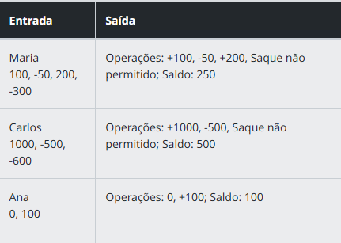

Descrição
Implemente uma classe chamada ContaBancaria para representar uma conta bancária simples. Essa classe deve permitir que você realize as operações básicas de uma conta: depósito, saque e consulta de saldo. O saldo negativo.

Requisitos
A classe ContaBancaria deve ter:

Atributos:
titular (nome do dono da conta).
saldo (saldo inicial, que começa com 0 por padrão).
Métodos:
depositar(valor): adiciona o valor informado ao saldo.
sacar(valor): subtrai o valor informado do saldo, se houver saldo suficiente. Caso contrário, exiba a mensagem "Saque não permitido".
saldo_atual(): retorna o saldo atual da conta.
Entrada
1.  Nome do titular (string).
2.  Sequência de valores representando operações de depósito e saque:

Valores positivos representam depósitos.
Valores negativos representam saques.
Saída
Exiba as operações realizadas e o saldo final no formato:  "Operações: +500, -200; Saldo: 300" 

Exemplos
A tabela abaixo apresenta exemplos com alguns dados de entrada e suas respectivas saídas esperadas. Certifique-se de testar seu programa com esses exemplos e com outros casos possíveis.

Atenção: É extremamente importante que as entradas e saídas sejam exatamente iguais às descritas na descrição do desafio de código.

Explicação:
A classe ContaBancaria tem os atributos titular, saldo e operacoes.
O método depositar(valor) adiciona o valor ao saldo e registra a operação.
O método sacar(valor) verifica se há saldo suficiente antes de permitir o saque.
O método extrato() imprime as operações formatadas corretamente, garantindo a saída esperada.
O código principal lê a entrada, processa os valores e imprime o resultado conforme os exemplos fornecidos.
Agora, se você rodar esse código com as entradas fornecidas no exemplo, obterá as saídas corretas