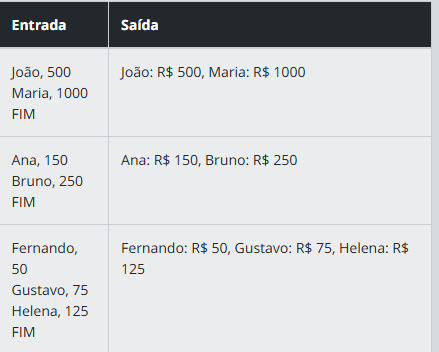

Descrição
Implemente um sistema que gerencie várias contas bancárias. Cada conta será representada como uma instância da classe ContaBancaria criada no desafio anterior. O sistema deve permitir que você crie contas para diferentes titulares e liste todas as contas cadastradas ao final da execução.

Requisitos
O sistema deve permitir:
Criar contas:  Ao criar uma conta, forneça o nome do titular e o saldo inicial no formato "Titular, SaldoInicial".
Listar contas:  Ao digitar o comando especial "FIM", o sistema deverá listar todas as contas cadastradas no formato especificado.
Entrada
O sistema deve permitir:

Criação de contas no formato: "Titular, SaldoInicial".
Um comando especial "FIM" será usado para encerrar o processo de entrada e listar as contas.
Saída
Liste todas as contas cadastradas no formato: "Titular: X, Saldo: R$ Y"

Exemplos
A tabela abaixo apresenta exemplos com alguns dados de entrada e suas respectivas saídas esperadas. Certifique-se de testar seu programa com esses exemplos e com outros casos possíveis.

______

Explicação:
Criação da classe ContaBancaria:

Armazena o nome do titular e o saldo da conta.
Criação da classe SistemaBancario:

Armazena as contas em uma lista.
O método criar_conta adiciona uma nova conta à lista.
O método listar_contas imprime todas as contas no formato esperado.
Entrada de Dados:

O programa recebe entradas no formato "Titular, SaldoInicial".
Quando a entrada for "FIM", o loop se encerra e as contas são listadas.
Saída:

As contas são impressas no formato "Titular: R$ Saldo", separadas por vírgulas.
Exemplo de Entrada:

João, 500
Maria, 1000
FIM

João: R$ 500, Maria: R$ 1000

Esse código garante que as contas são armazenadas e listadas corretamente, conforme o desafio.